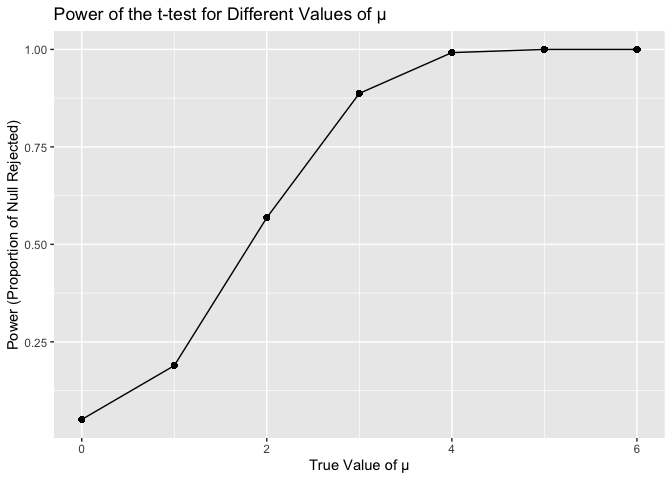
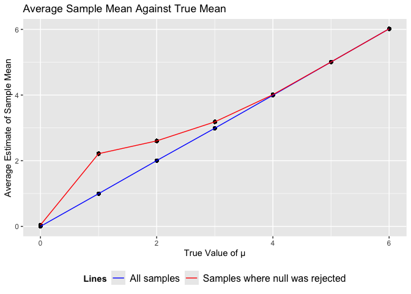
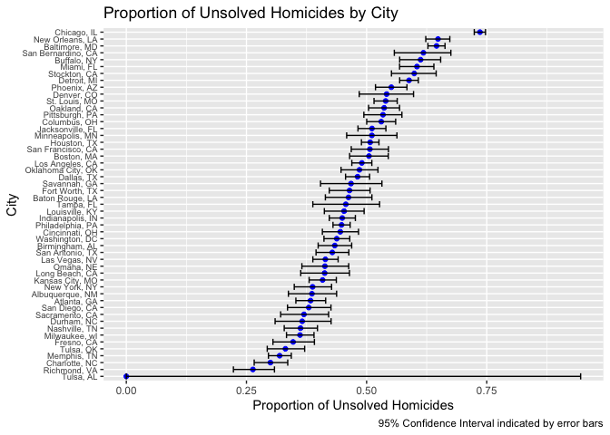

p8105 Hw#5
================
Kaylin De Silva
11-15-2024

**Problem 2** \#loading libraries and fixing output

``` r
library(tidyverse)
```

    ## ── Attaching core tidyverse packages ──────────────────────── tidyverse 2.0.0 ──
    ## ✔ dplyr     1.1.4     ✔ readr     2.1.5
    ## ✔ forcats   1.0.0     ✔ stringr   1.5.1
    ## ✔ ggplot2   3.5.1     ✔ tibble    3.2.1
    ## ✔ lubridate 1.9.3     ✔ tidyr     1.3.1
    ## ✔ purrr     1.0.2     
    ## ── Conflicts ────────────────────────────────────────── tidyverse_conflicts() ──
    ## ✖ dplyr::filter() masks stats::filter()
    ## ✖ dplyr::lag()    masks stats::lag()
    ## ℹ Use the conflicted package (<http://conflicted.r-lib.org/>) to force all conflicts to become errors

``` r
library(dplyr)
library(rvest)
```

    ## 
    ## Attaching package: 'rvest'
    ## 
    ## The following object is masked from 'package:readr':
    ## 
    ##     guess_encoding

``` r
set.seed(1)
```

This chunk loads the tidyverse and dplyr libraries.

``` r
datasets = function(n = 30, mu = 0, sigma = 5) {
  
  sim_data = tibble(
    x = rnorm(n, mean = mu, sd = sigma),
  )
  return(sim_data)
}

output = data.frame(mu=numeric(), mu_hat=numeric(),p_value=numeric())

for (mu in 0:6) {
  for (i in 1:5000) {
    sim_data=
    datasets(n=30, mu = mu, sigma = 5)
    t_test_result = t.test(sim_data$x, mu=0)
    t_test = broom::tidy(t_test_result)
    output= bind_rows(output,
                      data.frame(
                        mu=mu,
                        mu_hat = t_test$estimate,
                        p_value = t_test$p.value))
    }
}

head(output)
```

    ##               mu     mu_hat    p_value
    ## mean of x...1  0  0.4122909 0.62871127
    ## mean of x...2  0  0.6638729 0.36805102
    ## mean of x...3  0  0.5513902 0.53429999
    ## mean of x...4  0  0.5666638 0.48731552
    ## mean of x...5  0 -1.6501403 0.05985033
    ## mean of x...6  0  1.1850151 0.22862878

``` r
output = output|>
  mutate(
    conclusion = ifelse(
      p_value <0.05, "Reject", "Fail to Reject")) |>
      group_by(mu) |>
        mutate(
    power = 
      mean(conclusion == "Reject"))
    
output|> 
  ggplot(aes(y=power, x=mu)) +
  geom_point() +
  geom_line() +
  labs(
    title = "Power of the t-test for Different Values of μ",
    x = "True Value of μ",
    y = "Power (Proportion of Null Rejected)"
  )
```

<!-- -->

**Describe the association between effect size and power**

``` r
output_gg =output |>
  mutate(
    avg_mu_hat = mean(mu_hat)) 

output_gg_reject = output |> 
  filter(conclusion=="Reject") |>
   mutate(
     avg_mu_hat = mean(mu_hat))

output_gg_plot = output_gg|>
  ggplot(aes(y=avg_mu_hat, x=mu)) + 
  geom_point() + 
  labs(
    title = "Average Sample Mean Against True Mean",
    x = "True Value of μ",
    y = "Average Estimate of Sample Mean")

output_gg_total  =
  output_gg_plot +
  geom_point(data = output_gg_reject, aes(y=avg_mu_hat, x=mu)) +
  geom_line(data = output_gg, aes(y=avg_mu_hat, x=mu, color = "All samples")) +
  geom_line(data = output_gg_reject, aes(y=avg_mu_hat, x=mu, color = "Samples where null was rejected")) +
  scale_color_manual(values = c("All samples" = "blue", "Samples where null was rejected" = "red"), name = "Lines") +
  theme(legend.position = "bottom", 
        legend.title = element_text(face = "bold"), 
        legend.text = element_text(size = 12))

print(output_gg_total)
```

<!-- -->

**Not equal where null was less likely to be rejected**

**Problem 3**

``` r
raw_washington_df = read.csv(file = "./homicide-data.csv")

head(raw_washington_df)
```

    ##          uid reported_date victim_last victim_first victim_race victim_age
    ## 1 Alb-000001      20100504      GARCIA         JUAN    Hispanic         78
    ## 2 Alb-000002      20100216     MONTOYA      CAMERON    Hispanic         17
    ## 3 Alb-000003      20100601 SATTERFIELD      VIVIANA       White         15
    ## 4 Alb-000004      20100101    MENDIOLA       CARLOS    Hispanic         32
    ## 5 Alb-000005      20100102        MULA       VIVIAN       White         72
    ## 6 Alb-000006      20100126        BOOK    GERALDINE       White         91
    ##   victim_sex        city state      lat       lon           disposition
    ## 1       Male Albuquerque    NM 35.09579 -106.5386 Closed without arrest
    ## 2       Male Albuquerque    NM 35.05681 -106.7153      Closed by arrest
    ## 3     Female Albuquerque    NM 35.08609 -106.6956 Closed without arrest
    ## 4       Male Albuquerque    NM 35.07849 -106.5561      Closed by arrest
    ## 5     Female Albuquerque    NM 35.13036 -106.5810 Closed without arrest
    ## 6     Female Albuquerque    NM 35.15111 -106.5378        Open/No arrest

The data set has 52,179 observations and 12 columns.

``` r
washington_df = raw_washington_df |>
  mutate(
    city_state = paste(city, state, sep=", ")
  )

summary = washington_df |>
  group_by(city_state)|>
  mutate(
    unsolved = ifelse(disposition != "Closed by arrest", "TRUE", "FALSE")) |>
  summarize(
    total_homicide = n(),
    total_unsolved= sum(unsolved == "TRUE"))
    
print(summary)  
```

    ## # A tibble: 51 × 3
    ##    city_state      total_homicide total_unsolved
    ##    <chr>                    <int>          <int>
    ##  1 Albuquerque, NM            378            146
    ##  2 Atlanta, GA                973            373
    ##  3 Baltimore, MD             2827           1825
    ##  4 Baton Rouge, LA            424            196
    ##  5 Birmingham, AL             800            347
    ##  6 Boston, MA                 614            310
    ##  7 Buffalo, NY                521            319
    ##  8 Charlotte, NC              687            206
    ##  9 Chicago, IL               5535           4073
    ## 10 Cincinnati, OH             694            309
    ## # ℹ 41 more rows

``` r
baltimore_df = summary |>
  filter(city_state == "Baltimore, MD") 

output_df = data.frame(proportion=numeric(), confidence_lower=numeric(), confidence_higher=numeric())

baltimore_test=
  prop.test(baltimore_df$total_unsolved, baltimore_df$total_homicide)|>
  broom::tidy()

output_df= bind_rows(output_df,data.frame(
                        proportion = baltimore_test$estimate,
                        confidence_lower = baltimore_test$conf.low,
                        confidence_higher = baltimore_test$conf.high))
```

``` r
prop_test_full = function(total_unsolved, total_homicide) {
  test_result = prop.test(total_unsolved, total_homicide)
  test_result_tidy = broom::tidy(test_result)
  
  return(test_result_tidy)
}

output_df_full = summary |>
  mutate(test_result=
           purrr::map2(total_unsolved, total_homicide, prop_test_full)) |>
  unnest(test_result) |>
  select(city_state, estimate, conf.low, conf.high) 
```

    ## Warning: There was 1 warning in `mutate()`.
    ## ℹ In argument: `test_result = purrr::map2(total_unsolved, total_homicide,
    ##   prop_test_full)`.
    ## Caused by warning in `prop.test()`:
    ## ! Chi-squared approximation may be incorrect

Warning checked, seems to be the result of small sample sizes in certain
cities (i.e. Tulsa, AL)

``` r
output_df_full|>
  ggplot(aes(x=reorder(city_state, estimate), y = estimate)) +
  geom_point(color = "blue")+
  geom_errorbar(aes(ymin=conf.low, ymax=conf.high))+
  coord_flip() +
  labs(
    title = "Proportion of Unsolved Homicides by City",
    x = "City",
    y = "Proportion of Unsolved Homicides",
    caption = "95% Confidence Interval indicated by error bars"
  ) +
  theme(
    axis.text.y = element_text(size = 7))
```

<!-- -->
